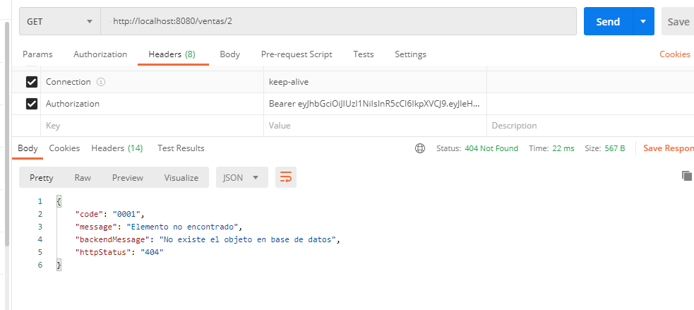

# Solucion de prueba a SOAINT

###Tener en cuenta para levantar la Base de datos

- Ejecutar el script en MySQL que se encuentra en la raiz del proyecto dentro de la carpeta "/script/"
- Cambiar por la contraseña que se tenga en el archivo properties

###Evidencia de respuesta de error

# 

### Recomendaciones

> Se pueden agregar mas tablas a la base de datos para mejorar el movimiento de la gran cantidad de datos.
> Pueden agregarse mayor cantidad de metodos reactivos para tener una mejor experiencia de usuario.